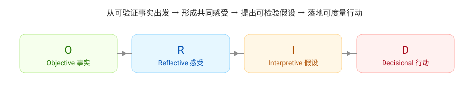

# Concept

本仓库把持续改进的关键概念拆分为多个可复用的文档，便于在 workflow/skill/前端中按需引用。选择这些概念的原因是：它们覆盖了“问题发现 → 根因分析 → 问题解决（固化机制）”的完整链路，能避免改进退化成口号或模板化复盘。

- 入口（本页）：阅读顺序与链接
## 问题发现

- [快速反馈](./concept/rapid-feedback.md)
- [透明性与阻碍点](./concept/transparency.md)
- [沟通协作与文档问题的发现机制](./concept/discovery-mechanisms.md)
- [持续集成与持续交付（CI / CD）](./concept/ci-cd.md)

## 根因分析

- [ORID](./concept/orid.md)
- [5 Whys](./concept/5why.md)

## 问题解决（方案落地与机制固化）

- [质量左移](./concept/shift-left-quality.md)
- [AI 赋能（AI-Enabled）](./concept/ai-enabled.md)
- [人才模型：T / π / # 型](./concept/talent-models.md)
- [代码坏味道与重构](./concept/code-smell-refactoring.md)
- [整洁代码](./concept/clean-code.md)
- [整洁架构](./concept/clean-architecture.md)
- [提升基线（Raise the Baseline）](./concept/raise-baseline.md)
- [行动项与跟踪](./concept/actions.md)
- [PDCA](./concept/pdca.md)
- [敏捷-持续改进](./concept/agile-continuous-improvement.md)

## 为什么以 ORID 作为主要推动框架

持续改进最常见的失败之一，是把“事实、情绪、解释、决策”混在一起讨论，导致结论被立场与噪音牵引，行动项不可验收、不可复盘。ORID 的价值在于把讨论强制分层：

- O 段只允许事实：让团队先对齐数据窗口与证据
- R 段承认摩擦：把感受说清楚，但不允许直接归因
- I 段提出假设：必须同时给证据与反证/数据缺口
- D 段形成决策：把方向落到可验证目标与行动原则

这使得 ORID 特别适合作为“持续改进的推动框架”：既能承载讨论，也能承载验证与行动闭环。

## 建议阅读顺序（从发现到固化）

1. 问题发现：快速反馈 → 透明性 → CI/CD（把信号拉回事实）
2. 根因分析：ORID → 5 Whys（把事实转成可验证假设）
3. 问题解决：质量左移 → 工程化（坏味道/整洁/架构）→ 提升基线 → 行动项与 PDCA 固化
