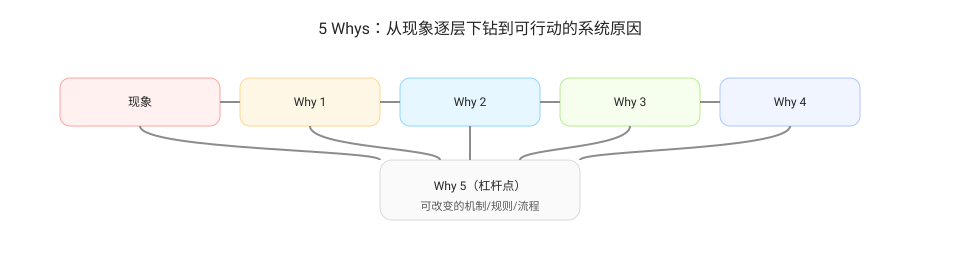
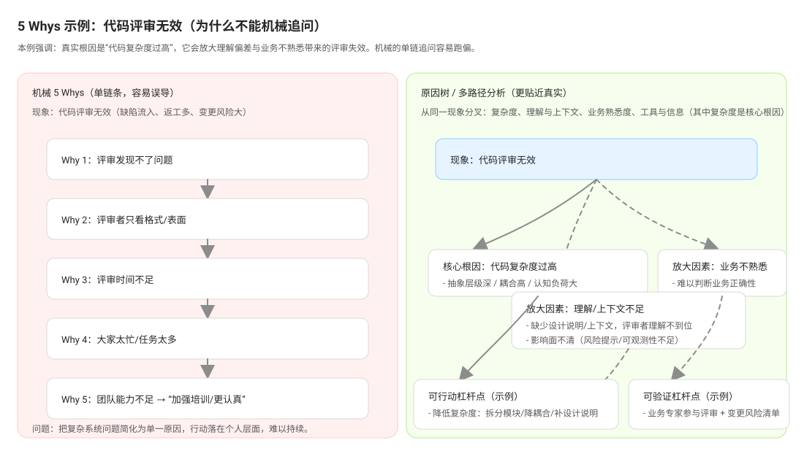

# 5 Whys（五个为什么）

当某个问题需要进一步“下钻到可行动的系统原因”时，使用 5 Whys：

5 Whys 的目的不是“问到第 5 个就结束”，而是帮助团队从现象走向机制层的杠杆点：

- 第 1 个为什么：把现象和具体偏差点对齐（指标/样本）
- 第 2–4 个为什么：逐步从“事件”走向“机制/制度/流程/接口契约/依赖关系”
- 第 5 个为什么：落到可改变的杠杆点（规则、节奏、入口标准、WIP、自动化、责任边界）

## 为什么 5 Whys 不是线性的

实际问题往往有多个并行原因（网状因果），同一个“Why”可能分叉成多条路径；因此更推荐把 5 Whys 当作“下钻框架”，并结合原因树/思维导图把分叉原因展开后再收敛到杠杆点。

输出要求：

- 每个“为什么”都要对应可引用的证据或明确的待补采数据
- 最后一层要能直接映射到行动项（可在 D 段转化为可验收任务）

## 示例：代码评审无效（为什么不能机械追问）

这个示例展示了“代码评审无效”通常不是单一原因链条，而是多条原因并行叠加：入口质量、评审时长、评审关注点、工具支持、团队约定、上下游节奏都会共同作用。若只沿着单条链条机械追问，容易错过关键分支并把结论简化为“人不认真/能力不足”，导致改进不可持续。

---

上一篇：[行动项与跟踪](./actions.md)  
下一篇：[敏捷-持续改进](./agile-continuous-improvement.md)
