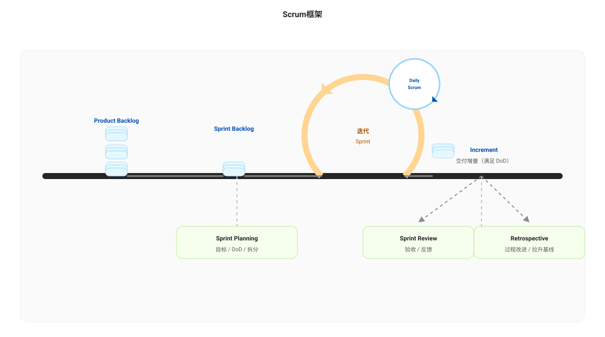

# 敏捷 · 持续改进

敏捷强调“以反馈驱动学习”，持续改进通常以迭代节奏落地：

- 以迭代为窗口：在固定时间窗内观察流动、质量与协作信号，避免只凭体感做结论
- 以实验为单位：把改进当作假设检验（定义期望影响的指标 + 观察方法），小步快跑、快速回滚
- 以系统为对象：优先改机制/入口标准/WIP/自动化与协作接口，而不是归因到个人能力
- 以可复盘为前提：记录“当时的证据、假设、行动与结果”，让下一轮复盘可复用

## Scrum 框架与回顾会的位置

回顾会（Sprint Retrospective）位于一个迭代的末尾，用于把“本迭代的事实与摩擦”转化为下一迭代的改进行动与实验设计。它通常与评审（Sprint Review）相邻，但关注点不同：

- Sprint Review：面向产品增量与价值反馈（做了什么、是否满足需求）
- Sprint Retrospective：面向过程与协作机制（为什么会这样、下一步怎么改）

### 重要原则：不是非要等到回顾会才能改进

改进应该越早越好。等到回顾会再处理，往往已经产生了延期、返工或线上风险。

建议把“及早发现、及早解决”落到日常机制：

- 每日站会关注阻碍（blocker）：把阻碍明确写出来并分配责任与时间盒
- 看板与 WIP 约束：一旦某泳道堆积，就把“清障”作为优先事项
- PR/CI 质量门禁：问题在 PR 与 CI 阶段被拦截，而不是上线前集中爆发
- 透明性信号触发改进：燃尽偏离、review latency 上升、重开率/缺陷逃逸率上升时，立即做小步调整

## 无效改进的常见情况（反例）

持续改进失败往往不是“没有努力”，而是方法论没有闭环。以下是常见的无效改进形态与例子：

1. 没有数据：只凭体感得出结论，无法判断问题是否真实存在或改善是否有效  
   - > `例子：会议里说“最近交付变慢了”，直接要求“大家加班赶进度”，但没有给出 lead time/cycle time 的趋势、样本或窗口对比，结果下一窗口依然波动，团队疲惫但没有定位瓶颈。`

2. 根因定位错误：把“症状”当根因，或者把相关性当因果  
   - > `例子：看到缺陷率上升就下结论“测试不认真”，于是增加测试用例数量；但真实原因是需求变更频繁 + 入口标准不清，导致返工与遗漏，增加用例只会扩大浪费。`

3. 流于表面的根因分析：只停留在“事件层”，没有追到机制/制度/接口契约/WIP 等杠杆点  
   - > `例子：评审无效被归因为“评审者没看懂”，但没有进一步分析为什么没看懂（复杂度、缺少设计说明、业务上下文缺失、变更过大、风险提示不足），于是行动项变成“认真一点”，无法复用。`

4. 口号式改进措施：行动不可执行/不可验收/不可验证，无法形成 PDCA 闭环  
   - > `例子：行动项写“提升质量、加强协作、提高效率”，但没有负责人、截止日期、验收方法（例如“两个窗口内 escaped defects ≤ X，review latency p75 ≤ Y”），最后只能在复盘会上重复同样的口号。`

## 流于形式的回顾会（反模式）

回顾会的目标是“基于证据→形成假设→做可验证的改进实验”。以下反模式会让回顾会看起来很热闹，但对结果没有帮助：

1. 形式花哨但内容空洞：贴纸很多、模板很复杂、结论很漂亮，但没有数据/没有优先级/没有下一步  
   - > `例子：回顾会上产出十几条“建议”，但没有把它们和指标（lead time、返工、逃逸缺陷等）对齐，也没有选出本窗口最关键的一个瓶颈，结果下个迭代依然“什么都改了但什么都没变”。`

2. 跳过回顾会：只做“汇报式周会”，没有专门留出复盘与改进的时间  
   - > `例子：迭代结束只过一遍任务清单，没有讨论“哪些等待/返工导致了拖期”，于是问题被带入下个迭代，交付波动长期存在。`

3. 一言堂式回顾会：结论由少数人拍板，其他人缺少表达空间，真实信息被过滤  
   - > `例子：负责人直接定性“问题是测试不够努力”，导致一线成员不愿再提供反证（需求变更、变更规模、入口标准等），行动项也只能停留在“更认真”。`

4. 只谈感受不谈证据：全是体验与情绪，没有把讨论锚定到可复核的事实  
   - > `例子：讨论集中在“最近好累/沟通太差”，但没有把“沟通太差”拆成可观察的信号（需求反复澄清次数、阻塞时长、评审等待等），最后只能归结为“加强沟通”。`

5. 只做总结不做实验：没有把改进变成最小可行变更（MVP change），缺少验收与时间盒  
   - > `例子：提出“提升代码评审质量”，但没有定义“评审质量”怎么衡量（review latency、变更规模、缺陷发现率、逃逸缺陷），也没有约定两周后如何验证，导致改进无法闭环。`

6. 没有行动项（或行动项无法落地）：讨论热闹但没有形成可执行的下一步  
   - > `例子：回顾会最后只有“下次注意/加强沟通/提升质量”，没有拆成可以在一个迭代内完成的具体行动，下一次回顾会只能重复同样的话题。`

7. 行动项没有负责人：所有人都觉得“有人会做”，最后往往无人推进  
   - > `例子：提出“优化 CI 流程”，但没有 owner，也没有依赖协调与时间盒，最后一直停留在“大家都同意”。`

8. 行动项没有验收方法：即使做了也无法判断是否有效，无法形成 PDCA 的 Check/Act  
   - > `例子：行动项写“提升代码评审质量”，但没有验收口径（review latency、变更规模、缺陷发现率等）与对比窗口，结果变成“做了”但不知道“有没有用”。`

---

上一篇：[5 Whys](./5why.md)  
下一篇：[Concept](../concept.md)
