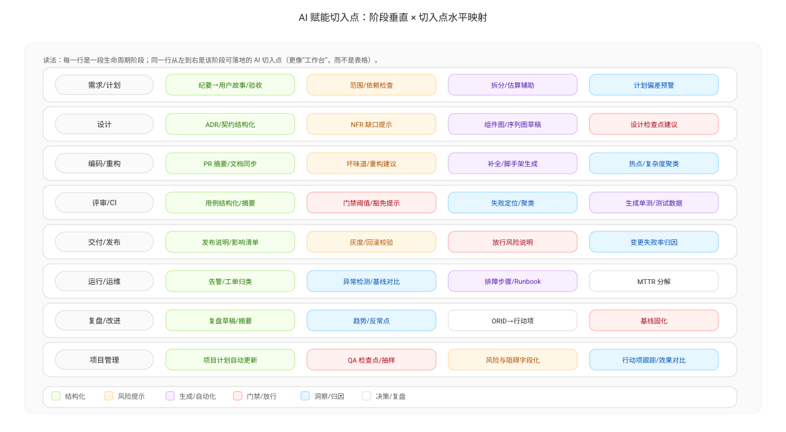

# AI 赋能（AI-Enabled）

AI 赋能的价值不是“替代人”，而是把高频、低价值、易遗漏的工作自动化或半自动化，让团队把精力用在更关键的判断与协作上：对齐事实、识别风险、验证假设、落地行动、抬升基线。

## AI 最适合做什么

### 1) 把信息“结构化”

- 从需求/缺陷/PR/流水线日志中提取字段：时间、状态、关键结论、风险标签
- 把碎片信息变成可检索的摘要：按模块/原因/负责人聚合

### 2) 把风险“提前暴露”

- 在 PR 阶段给出风险提示：变更规模过大、缺少测试、影响面不清
- 在需求阶段提示缺口：验收标准缺失、边界条件缺失、依赖未对齐

### 3) 把复盘“从口号拉回证据”

- 自动生成 ORID 的草稿结构：先列 O 段事实，再引导 R/I/D
- 自动生成反证问题清单：哪些数据会推翻当前假设、缺口在哪里

### 4) 把行动项“写成可验收”

- 将决策点改写为行动项模板：责任人/开始时间/截止/验收方法/预期效果
- 生成验收口径：对比窗口、抽样方式、阈值或分位数目标

## AI 不适合做什么（常见坑）

- 直接给结论：没有证据链，会把偏见放大
- 代替团队共识：协作问题必须靠机制与契约解决
- 代替质量门禁：门禁应由可复现规则与自动化执行

## AI 与 ORID/PDCA 的结合方式

- O：用 AI 辅助汇总事实，但事实必须可复核（来源、窗口、口径）
- R：AI 可辅助归纳摩擦点，但团队要确认表达是否准确
- I：AI 可辅助列出假设与验证方式，但必须保留反证与数据缺口
- D：AI 可辅助生成行动项草稿，但必须指定负责人、开始时间、验收方法

## 落地建议（最小可行）

- 先从“节省检索成本”开始：自动汇总周度事实与异常样本
- 再从“减少遗漏”开始：PR/需求检查清单的自动提示
- 最后从“抬升基线”开始：把有效模板固化到流程与门禁里

## 项目管理侧的 AI 切入点（常见）

- 需求质量：从需求描述中识别缺失项（验收标准/边界条件/依赖/回滚/监控），输出检查清单
- 范围与变更：自动识别“范围变更/插入项/返工回流”并解释对燃尽与交付的影响
- 风险雷达：根据历史缺陷与延迟模式，给出本迭代的高风险模块/高风险故事提示
- 复盘助理：自动汇总 O 段事实、阻碍清单与异常样本，生成 ORID 的草稿结构
- 行动项生成：把决策点改写为行动项字段（责任人/开始/截止/验收/预期效果/实际效果记录模板）

---

上一篇：[质量左移](./shift-left-quality.md)  
下一篇：[人才模型：T / π / # 型](./talent-models.md)
