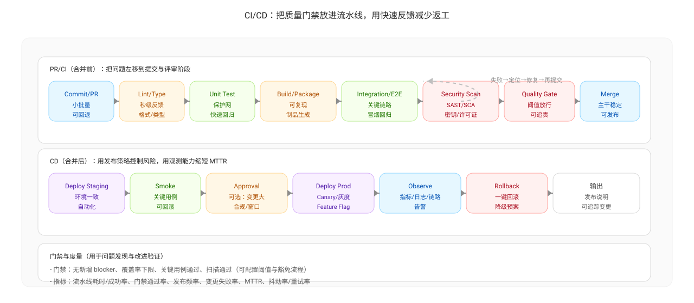

# 持续集成与持续交付（CI / CD）

持续集成（CI）与持续交付/持续部署（CD）是“快速反馈”与“质量左移”的关键基础设施。它们把质量检查与交付流程变成自动化流水线，让问题尽可能早、尽可能低成本地暴露。

## CI 的作用（让问题在合并前暴露）

CI 的核心是“每天/每次变更都集成”，并在统一环境里自动执行质量检查：

- 构建与依赖一致性：避免“我本地能跑”导致的集成失败
- 自动化测试：把回归验证前移（减少后段测试扎堆与返工）
- 静态扫描/规范检查：把低级错误、坏味道、风险模式在 PR 阶段拦截
- 质量门禁：将“是否允许合并”与门禁绑定，避免问题进入主干

在项目度量上，CI 往往与这些信号相关：

- CI 成功率、CI 耗时（影响交付节奏与反馈速度）
- 代码扫描通过率（反映质量门禁有效性与质量债务趋势）
- review latency（评审等待与门禁等待叠加时，会显著变慢）

## CD 的作用（让交付可预测、可回滚）

CD 的目标不是“更快上线”，而是让交付成为一个稳定、可复用、可回滚的过程：

- 把发布变成低风险事件：小批量、可观测、可回滚
- 把发布频率提升到团队可承受水平：减少“最后一刻大集成”
- 把变更失败率与恢复时间纳入日常治理：失败可预期、恢复有机制

在度量上，CD 通常对应：

- 发布频率（Deployment Frequency）
- 变更失败率（Change Failure Rate）
- 平均恢复时间（MTTR）

## CI/CD 如何支持 ORID 与持续改进

- O（事实）：流水线结果、门禁失败原因、失败分布、耗时分布、回滚次数等都是可复核事实
- I（假设）：例如“CI 不稳定导致合并排队 → review latency 上升 → 交付周期拉长”
- D（行动）：把“修 CI/优化门禁/缩短反馈”写成可验收行动项（负责人、开始时间、验收方式）

---

上一篇：[沟通协作与文档问题的发现机制](./discovery-mechanisms.md)  
下一篇：[质量左移](./shift-left-quality.md)
