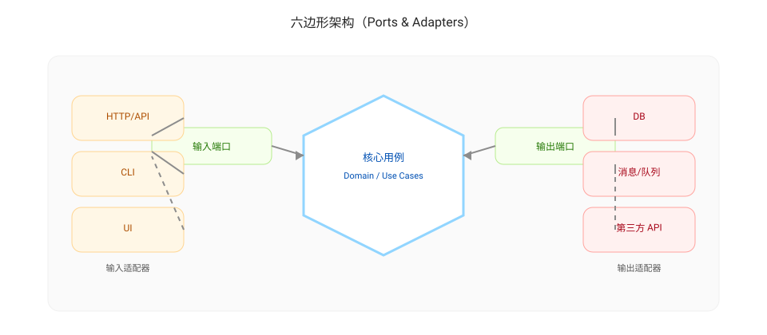

# 整洁架构（Clean Architecture）

整洁架构的目标是让系统在长期演进中保持可理解、可测试、可替换、可扩展，从而降低“改不动/不敢改/一改就炸”的交付阻碍。

## 核心思想：依赖规则（Dependency Rule）

依赖只能指向更稳定的核心：

- 核心业务规则（Entities / Domain）
- 用例与业务流程（Use Cases / Application）
- 接口适配层（Interface Adapters）
- 框架与外部系统（Frameworks & Drivers：Web、DB、消息、第三方 API）

越靠外层变化越频繁，越不应该让核心依赖外层细节。

## 为什么整洁架构能提升质量与交付

- 测试更容易：核心逻辑不依赖 DB/HTTP，可用单元测试快速验证
- 变更更可控：替换框架/数据库/外部 API 时，不需要撬动核心逻辑
- 风险更可见：边界明确后，影响面更容易评估，评审更快

与度量的常见关系：

- 评审等待变长：边界不清导致 reviewer 无法确认影响面
- 缺陷回流增多：变化扩散（shotgun surgery）与隐式耦合导致返工
- 覆盖率长期不动：核心逻辑与外部系统纠缠，导致测试难写

## 常见的“边界”划分方式

不强制某一种目录结构，但建议至少明确三类边界：

- Domain：领域对象、规则、约束（尽量纯）
- Application：用例编排（输入校验、事务边界、调用顺序）
- Infrastructure：数据库、HTTP 客户端、消息、第三方 SDK、框架适配

关键实践：

- 用接口隔离外部系统（Repository/Gateway），核心只依赖接口
- 把 DTO/序列化留在边界层，不让其污染 Domain
- 把时间、随机数、配置等不稳定依赖抽象并注入

## 六边形架构（Hexagonal Architecture）

六边形架构强调“以用例为中心”，通过端口（Ports）与适配器（Adapters）把外部世界隔离开：

映射到落地实践：

- Ports：面向业务的接口（输入端口/输出端口），由核心定义
- Adapters：实现端口的技术细节（HTTP、DB、消息、第三方 API）
- 测试：用替身实现输出端口，即可测试核心用例，不需要真实外部依赖

## 常见反模式

- 框架驱动：Controller 里堆业务逻辑，导致测试与复用困难
- 数据库驱动：Domain 直接依赖 ORM Model，业务规则被持久化细节绑死
- “横向共享”工具类：到处 import 的 util 变成隐式耦合点
- 依赖环：模块互相调用，变更扩散且难以定位

## 可执行的改进动作

- 先选一个高返工模块：把核心规则从 Controller/Service 中提取到 Use Case
- 把外部依赖抽成接口：先让核心可测试，再逐步重构基础设施层
- 在 CI 中建立最小门禁：核心模块必须通过单元测试与扫描，无新增 blocker

---

上一篇：[整洁代码](./clean-code.md)  
下一篇：[提升基线（Raise the Baseline）](./raise-baseline.md)
