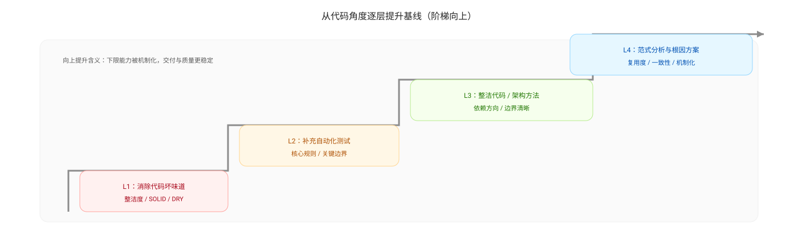

# 提升基线（Raise the Baseline）

提升基线的意思是：把一次改进从“本次做到了”变成“以后默认就这样做”，持续抬升团队的下限能力，让质量与交付稳定性不再依赖个体英雄主义或临时运动。

## 为什么提升基线很重要

- 不提升基线，改进会回滑：一段时间后又回到老问题，复盘变成循环抱怨
- 不提升基线，数据会失真：行动项做了，但机制没变，指标改善不可持续
- 提升基线能减少认知负担：把正确做法写进流程与工具，减少反复提醒

## 提升基线的落点（从软到硬）

1. 文档与模板（软约束）
   - 需求验收清单、设计摘要模板、PR checklist、回滚策略模板
2. 流程规则（中约束）
   - DoR/DoD、WIP 上限、评审 SLA、缺陷分级与处理策略
3. 自动化门禁（硬约束）
   - CI 强制执行扫描与测试、覆盖率下限、无新增 blocker、构建必须通过
4. 可观测与报警（硬约束）
   - 关键链路必须有日志/指标/追踪；异常阈值触发告警与复盘

## 如何判断“基线是否真的提升了”

基线提升应该能在多个窗口里稳定表现为：

- 质量信号更稳：缺陷逃逸率与重开率长期下降或稳定在阈值内
- 流动性更稳：交付周期/评审等待的长尾（p95）收敛
- 返工减少：需求澄清与验收失败回流下降
- CI 更稳：成功率与耗时稳定，门禁不再频繁被绕过

## 常见反模式

- 只写文档不落门禁：最后变成“看过就算”，无法形成系统约束
- 只加门禁不改机制：门禁失败频繁，团队通过“跳过/忽略”对抗，结果更糟
- 把基线当作一次性项目：缺少持续维护与复盘，规则很快失效

## 从代码角度逐层提升基线（建议路径）

1. 消除代码坏味道，提升整洁度（建立可读性下限）  
   目标：让代码更容易被理解与评审，降低缺陷引入概率。  
   常用原则：SOLID、DRY、KISS、最小暴露、命名清晰、低复杂度。

2. 补齐自动化测试（建立可回归下限）  
   目标：让重构与交付更安全，减少重开与返工。  
   方法：优先补齐核心规则与边界条件；把不稳定依赖抽象并注入，提升可测性。

3. 内建质量方法（建立结构下限）  
   目标：让系统结构更清晰、更可替换、更可扩展。  
   方法：整洁代码/整洁架构、设计模式（用于解耦与表达意图）、明确边界与依赖方向。

4. 从范式与根因设计解决方案（建立复用下限）  
   目标：避免在局部补丁里循环，把问题解决在“生成问题的结构”上。  
   方法：识别代码范式与架构风格（分层/事件驱动/领域模型/插件化等），在范式内设计根源性方案，提升复用度与一致性。

---

上一篇：[整洁架构](./clean-architecture.md)  
下一篇：[行动项与跟踪](./actions.md)
