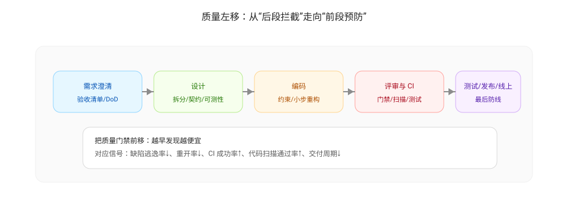

# 质量左移（Shift Left Quality）

质量左移的核心是把“发现缺陷与风险”的成本从后置阶段（测试/发布/线上）前移到更早阶段（需求澄清/设计/编码/评审/CI），让问题在影响扩大之前被看见并被修复。

## 为什么要做质量左移

- 后置发现成本更高：线上缺陷不仅修复成本高，还会引入回滚、客户影响与团队中断。
- 反馈越早越有效：越接近产生问题的环节，信息越完整，修复越精准。
- 让质量变成系统能力：把质量写入流程与自动化门禁，而不是依赖个体“更认真”。

与度量的关系（常见信号）：

- 缺陷逃逸率上升：质量没有在测试/发布前被拦截，缺陷外溢到线上
- 重开率上升：验收口径不清或修复质量不稳定，返工回流
- CI 成功率下降 / 代码扫描通过率下降：工程门禁失效或质量债务累积
- 交付周期拉长：返工与等待增加（评审/测试/发布扎堆）

## 质量左移的四个落地点

### 1) 需求左移：在“写代码之前”把质量做实

- 写清验收标准（DoD/验收清单）：关键路径/边界条件/回滚策略/非功能（性能/安全/可观测性）
- 把风险显性化：复杂度高/依赖多/变更面大时，先做拆分或技术预研
- 先对齐口径：测试与产品对“什么算完成”达成一致，减少重开与返工

### 2) 设计左移：降低复杂度与不可测性

- 拆分变更：把大需求拆成可独立验收的小批次
- 明确接口契约：输入/输出、错误语义、幂等性、兼容策略
- 为测试与观测留接口：可注入依赖、可模拟外部系统、可追踪关键链路

### 3) 编码左移：把缺陷“写不出来”

- 采用约束：lint/format/类型检查/静态扫描，减少低级问题进入代码库
- 使用自动化模板：脚手架、统一的错误处理、日志与指标埋点规范
- 让重构成为日常：小步持续重构，避免质量债务滚雪球

### 4) 交付左移：把质量门禁放在 PR 与 CI

- PR 级别门禁：单次变更规模限制、必须包含测试、必须通过扫描与构建
- CI 级别门禁：测试覆盖率下限、关键质量规则（blocker）为零、构建稳定性
- 可回滚交付：灰度/特性开关/回滚脚本，降低发布风险

## 常见反模式

- “左移”被误解为把测试人员提前介入但不改变机制：结果只是更早加班
- 只追覆盖率数字，不解决可测性：覆盖率上去了，缺陷逃逸率没有下降
- 质量门禁形同虚设：失败可以随意忽略/跳过，导致问题在后段集中爆发

## 可执行的最小行动项示例

- 定义 1 页验收清单模板（关键路径/边界/回滚/监控），两次迭代后对比重开率与缺陷逃逸率
- 在 PR 中启用“单次变更规模限制 + 必须包含测试”的门禁，对比 review latency 与缺陷率
- 对关键模块补齐可测接口（依赖注入/隔离外部系统），对比覆盖率与逃逸缺陷趋势

## 如何用可视化评审把质量左移

质量左移要落地，关键在于把“需求理解、风险识别、验收口径”前移到写代码之前，并把“设计/代码的风险点”前移到合并之前。以下两个仓库提供了可视化的评审方式，用于把这些事情系统化：

- 需求/规格评审：<https://github.com/visual-req/spec-review>  
  用于在需求阶段把“关键路径、边界条件、验收清单、风险与依赖”讨论清楚，减少返工与重开。

- 代码评审：<https://github.com/visual-req/code-review>  
  用于在编码与合并前把“变更影响面、关键链路、回滚策略、质量门禁结果”说清楚，减少缺陷逃逸与线上风险。

建议的使用方式（最小闭环）：

1. 在需求澄清阶段执行一次 spec-review：输出验收清单与风险列表（作为 DoD 的输入）
2. 在实现前做一次轻量设计对齐：明确接口契约与可测性（避免写出不可测结构）
3. 在 PR 阶段执行 code-review：限制变更规模、绑定测试与扫描结果、明确回滚策略
4. 在 CI 中把扫描/测试作为门禁：让问题在合并前暴露（而不是上线前集中爆发）

---

上一篇：[持续集成与持续交付（CI / CD）](./ci-cd.md)  
下一篇：[AI 赋能（AI-Enabled）](./ai-enabled.md)
