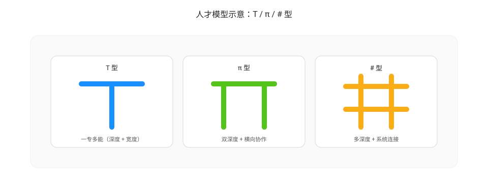

# 人才模型：T / π / # 型

持续改进需要“跨角色协作 + 深度技术能力 + 系统思维”。人才模型的作用是帮助团队识别能力结构，避免只追求单一维度（只会做业务或只会做技术）而导致协作阻碍与质量回流。

## T 型人才（T-shaped）

特点：

- 竖杠：某一领域有深度（例如后端、测试、架构、数据）
- 横杠：对相邻领域有足够理解，能协作与沟通

价值：

- 降低协作摩擦：能理解上下游约束与接口
- 更容易做质量左移：在需求/设计阶段识别风险

## π 型人才（Pi-shaped）

特点：

- 两条竖杠：两个领域的深度（例如“后端 + 测试自动化”“前端 + 可观测性”）

价值：

- 擅长打通关键链路：例如“开发 → 测试 → CI 门禁”
- 更适合承担改进机制的建设：把经验固化成工具/流程/门禁

## # 型人才（Hash-shaped）

特点：

- 多个深度方向 + 强横向连接能力（系统性）
- 能把复杂问题拆成机制与结构，而不仅是局部修补

价值：

- 更擅长做“提升基线”：把零散经验沉淀成标准、架构与平台能力
- 更擅长做“根因设计”：从范式与系统结构层面给出根源性方案

## 如何把人才模型接到持续改进

- ORID：T/π/# 型人才更容易把事实转成可验证假设，并把行动落到机制层
- 质量左移：需要跨角色理解（横向）与工程化能力（纵向）共同支撑
- 提升基线：需要“规则 + 工具 + 自动化门禁”的组合能力，通常由 π/# 型牵头更稳

---

上一篇：[AI 赋能（AI-Enabled）](./ai-enabled.md)  
下一篇：[代码坏味道与重构](./code-smell-refactoring.md)
