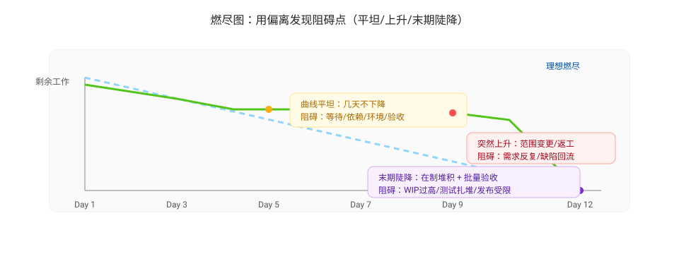
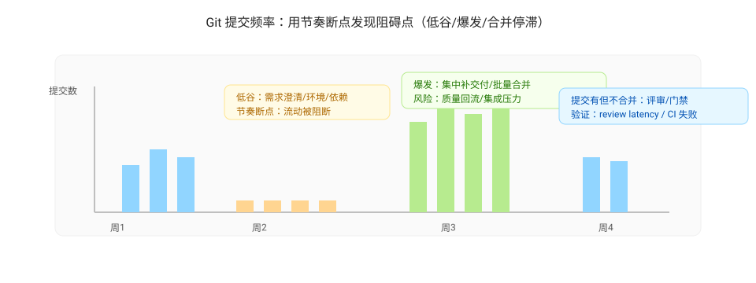
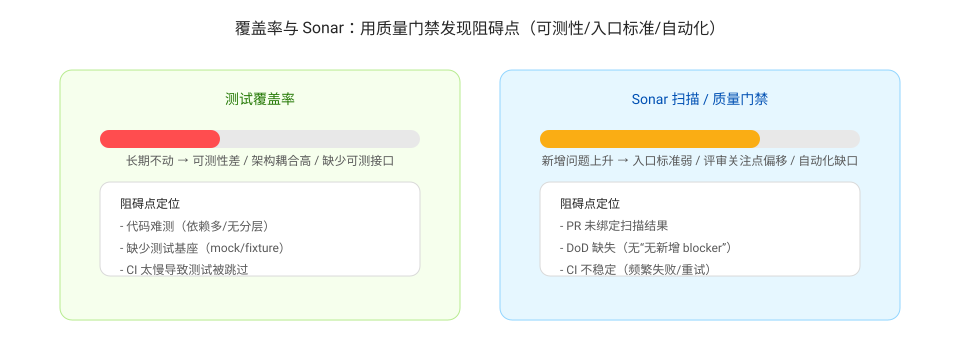
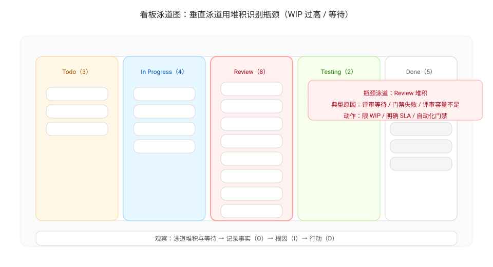
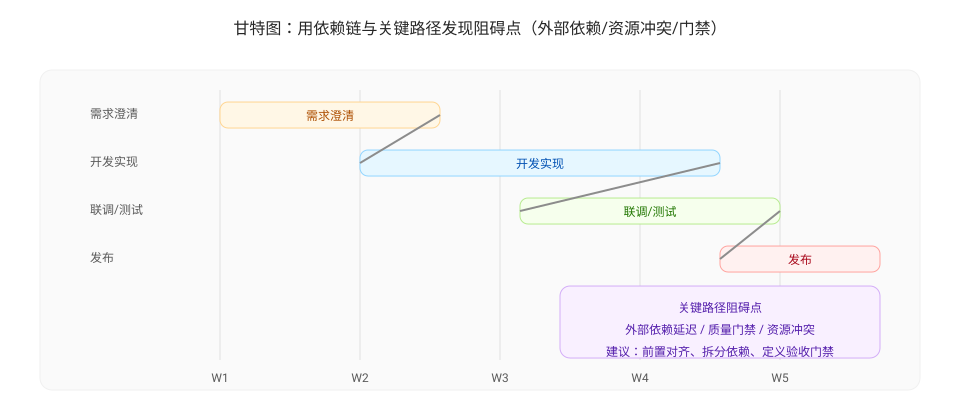
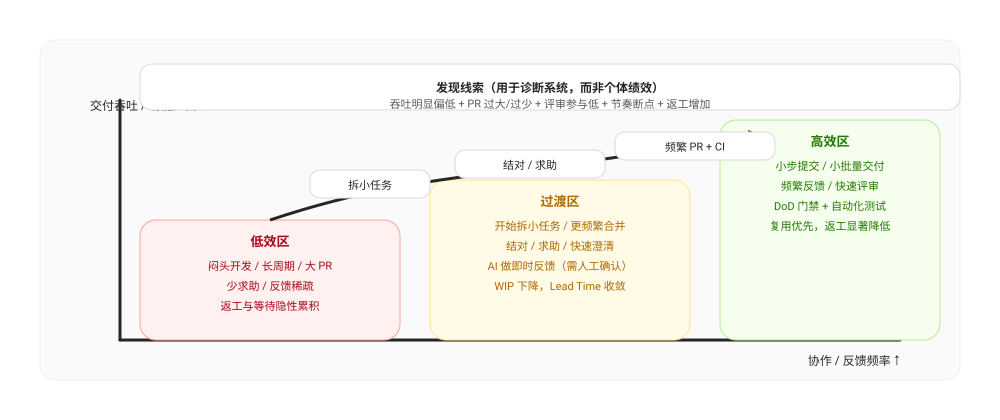

# 透明性与阻碍点（Transparency）

透明性的目标不是“让每个人被监控”，而是让团队能在同一张事实底座上协作：

- 让风险早暴露：在变成延期/线上事故之前被看见
- 让阻碍可定位：知道卡在哪里（需求澄清/开发/评审/测试/发布/依赖）
- 让行动可验证：每次改进都能用下一窗口的数据判断“有没有用”

下面给出四类常用的透明性工具与“如何发现阻碍点”的方法。

## 1) 燃尽图：用“偏离”定位阻碍点

燃尽图回答两个问题：

- 我们是否在以可预期的速度消耗范围（scope）？
- 偏离发生在什么时候、为什么发生？

### 读图要点（如何发现阻碍）

- 线条平坦（几天不下降）：通常是“无法完成/无法验收”的阻碍  
  典型原因：需求未澄清、外部依赖未交付、测试环境不可用、评审排队、发布窗口受限。
- 突然上升（剩余工作变多）：范围变更/返工显性化  
  典型原因：中途插入紧急需求、验收标准变化、缺陷回流导致返工。
- 末期陡降（最后几天才大量完成）：在制堆积 + 批量验收  
  典型原因：WIP 过高、测试集中在末期、集成/发布在末期“扎堆”。

### 把阻碍点变成可行动的问题

不要写“进度慢”，而是写成可定位的问题，例如：

- “在迭代第 4–6 天燃尽曲线几乎不下降，对应看板上大量卡在 Testing 泳道，阻碍是否来自测试环境/验收口径？”
- “燃尽在第 7 天突然上升，范围新增来自哪里？是计划外需求还是返工？”

## 2) Git 提交频率：用“节奏断点”定位阻碍点

提交频率反映交付节奏与流动性（不是绩效指标）。它更适合用来发现“系统性卡点”：

### 读图要点

- 长时间低谷：可能是需求澄清/设计阶段卡住，或者开发环境/依赖不可用
- 突然爆发式提交：可能是批量合并、临近截止的集中补交付（风险：质量与返工）
- 高频但 PR 不合并：可能卡在评审等待/质量门禁

建议与以下信号联动验证：

- PR review latency（评审等待）
- PR lead time（PR 周期）
- CI 失败率/重试次数

## 3) 测试覆盖率与 Sonar 扫描：用“质量门禁”定位阻碍点

覆盖率与 Sonar（bugs/vulnerabilities/code smells/duplicated lines）这类信号常见的阻碍点是：

### 读图要点

- 覆盖率长期不动：测试难写/架构耦合高/缺少可测接口 → 阻碍在设计与工程化
- Sonar 新增问题持续上升：质量债务在累积 → 阻碍在“入口标准/评审关注点/自动化门禁”
- CI 上频繁失败：阻碍在构建稳定性、依赖管理或环境一致性

把它们转化为可执行的改进方向：

- 定义 DoD：关键模块必须有最小覆盖率 + 无新增 blocker 级别问题
- 把扫描结果和 PR 绑定：在 PR 级别发现问题，而不是上线前才爆发

## 4) 看板泳道图与甘特图：用“堆积与等待”定位阻碍点

看板泳道图更适合定位“流动/等待”的阻碍点；甘特图更适合暴露“依赖链与关键路径”：

### 看板泳道图读图要点

- 某个泳道长期堆积：瓶颈在该阶段（例如 Review/Testing/Release）
- 泳道之间等待时间长：交接/验收标准不清或容量不足
- WIP 长期超限：并行过多导致整体变慢（Little 定律：WIP ↑ → Lead Time ↑）

### 甘特图读图要点

- 关键路径上任务延期：会直接影响交付日期 → 阻碍通常在依赖/资源冲突/验收门禁
- 大量任务依赖一个外部交付：外部依赖是主要风险，应前置对齐与拆分

## 5) 例子：如何发现“低效率开发方式”，并帮助跃迁到高效区域

透明性可以帮助团队尽早发现一种常见风险：有人长期“闷头自己开发”，交付量明显低于同侪，并持续停留在低效区（但这不是绩效评估工具）。

### 现象（可复核的信号）

- 相同时间窗内，交付的用户故事数/完成点数显著更低（需要同口径、同复杂度分布的对比）
- PR 更少但更大：单个 PR 变更量大、周期长、返工多
- Review/协作信号偏低：主动请求评审、参与他人评审、在需求澄清/设计讨论中的参与度偏低
- 节奏断点更频繁：长时间“无可合并产出”，随后集中提交/集中合并

### 判断要点（先排除系统性原因）

- 是否被外部依赖/环境/权限卡住（看板等待、CI 失败、阻塞标签）
- 是否在高风险模块承担更高复杂度（用模块归属、缺陷回流、重构占比校验）
- 是否缺少及时反馈：需求不清、验收口径不明、评审排队导致“越改越大”

### 典型改进动作（让效率从低效区跃迁）

- 把任务拆到“1 天内可合并”的粒度，强制小步提交与频繁集成
- 在卡点上设立求助机制：结对编程/同伴评审/每日 10 分钟求助窗口
- 用 AI 做“即时反馈层”：生成用例骨架、定位可疑代码段、把问题表述结构化（但仍需人确认）
- 在 DoD 中固化：必须有最小自动化测试/无新增 blocker 级质量问题，避免返工雪球

## 把透明性信号接到 ORID 与行动项

透明性信号应该进入 ORID 的 O 段，避免“把感觉当事实”：

- O：燃尽偏离、看板堆积、提交节奏断点、质量门禁异常（必须可复核）
- R：团队摩擦（等待、返工、频繁插入、发布扎堆）
- I：原因假设（流程/协作接口/环境/质量标准/能力/工具）
- D：决策方向与行动项（负责人、开始时间、截止、验收、实际效果）

最重要的一条原则：透明性只为“更快定位阻碍并改进系统”，不用于个体绩效评估。

---

上一篇：[快速反馈](./rapid-feedback.md)  
下一篇：[沟通协作与文档问题的发现机制](./discovery-mechanisms.md)
