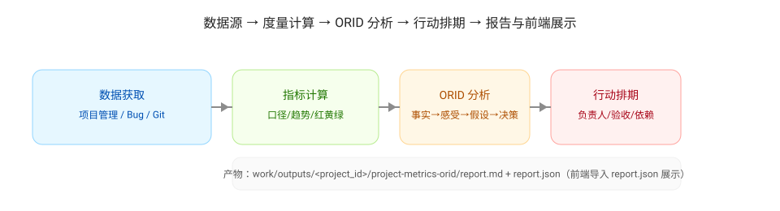

# Workflow

## 总览

输入（系统 API + 配置）→ 数据拉取与完整性诊断 → 指标计算与阈值判定 → ORID 分析 → 行动排期 → 报告与前端展示。

## 分步流程（对应 prompts）

### 1) 数据获取

- 使用 [01-data-collection.md](../skill/prompts/prjmx-collect/01-data-collection.md)
- 汇总三类数据源：
  - 项目管理：需求/任务流转与迭代信息
  - Bug：缺陷、严重级别、线上外溢、重开
  - Git：提交、PR、Review
- 输出：`raw.*` 与 `data_integrity`

### 2) 指标计算

- 使用 [02-metrics.md](../skill/prompts/prjmx-metrics/02-metrics.md)
- 计算：交付/流动、质量、计划可靠性、工程效率
- 对每个指标给出：定义、公式、当前值、趋势、红黄绿
- 输出：`metrics`

### 3) ORID 分析

- 使用 [03-orid.md](../skill/prompts/prjmx-orid/03-orid.md)
- 概念与方法拆解见 [ORID](./concept/orid.md)
- 要求：四段均引用上一步事实；给出原因假设的证据与反证
- 输出：`orid`

### 4) 输出与展示

- 使用 [04-output-and-frontend.md](../skill/prompts/prjmx-report/04-output-and-frontend.md)
- 抽取问题清单：`issues`
- 生成行动项与排期：`actions`
- 落盘：
  - `work/outputs/<project_id>/project-metrics-orid/report.md`
  - `work/outputs/<project_id>/project-metrics-orid/report.json`
- 前端：启动 `frontend/`（Vue + Ant Design Vue）并导入/粘贴 `report.json` 展示
