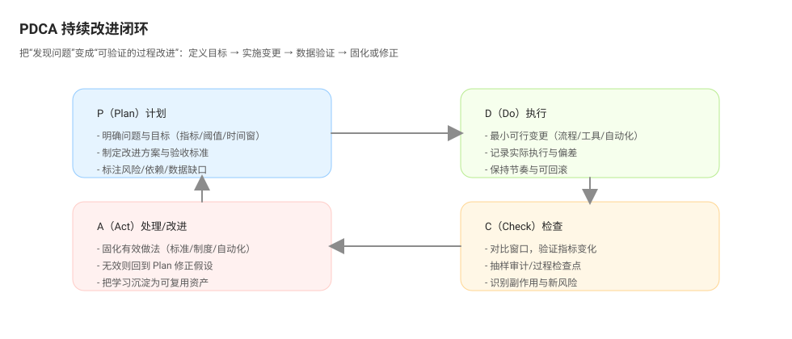

# 持续改进闭环（PDCA）

PDCA 是持续改进的通用闭环框架，用于把“发现问题”稳定地转化为“可验证的过程改进”：

- P（Plan）：定义问题与目标（指标/阈值/时间窗），制定改进方案与验收标准
- D（Do）：按最小可行变更实施（流程/工具/自动化/节奏），记录实际执行与偏差
- C（Check）：用数据与样本验证效果（对比窗口、抽样审计、过程检查点），识别副作用
- A（Act）：固化有效做法（标准化/制度化/自动化），无效则回到 Plan 修正假设

## P · Plan（计划）

目标：把“要改进什么”写清楚，避免用口号替代目标。

建议至少明确：

- 现状基线：当前窗口指标值与样本（例如 lead time p50=8.2 天；aging wip=12）
- 问题表述：用可讨论的中性表述描述偏差点（避免“谁的问题”）
- 改进假设：为什么这个改动会影响指标（机制层解释）
- 目标与阈值：改善到什么程度（指标 + 阈值/趋势 + 时间窗）
- 验收方法：如何验证（对比窗口、抽样方式、过程检查点、数据来源）
- 保护指标：防止“改善一个指标，恶化另一个指标”（例如吞吐、缺陷率）

## D · Do（执行）

目标：用最小可行变更（MVP change）验证假设，避免大爆改导致无法归因。

建议做法：

- 先做小步：把大方案拆成 1 个迭代内可完成的最小动作
- 明确责任：责任人、开始时间、截止时间、依赖与风险
- 记录执行事实：实际做了什么、偏离了什么、遇到的阻力是什么
- 保持可回滚：如果副作用明显，可以快速撤销或降级

## C · Check（检查）

目标：判断“有没有用”，而不仅是“做了没做”。

建议至少包含：

- 对比窗口：与基线对比（上一个迭代/过去 30 天 vs 当前 30 天）
- 抽样核验：抽样检查执行是否到位（例如抽 20 个 PR 是否包含设计摘要）
- 关注分布而非平均：p50/p75/p95 的变化往往比平均值更能反映体验
- 观察副作用：保护指标是否恶化（例如缺陷率、重开率、缺陷逃逸率）

## A · Act（处理/固化）

目标：把有效做法变成可复用机制；无效就回到 Plan 修正假设。

建议输出：

- 固化：把有效做法写入 DoR/DoD、工作流规则、自动化校验、模板与培训
- 调整：如果部分有效，明确下一轮要改动的假设与实验设计
- 停止：如果无效或成本过高，明确停止原因与替代方向
- 复盘留痕：保留“当时证据、假设、行动、结果”，让下一轮可复用

## 一个最小例子

问题：review latency p75 偏高，导致交付周期拉长。

- Plan：目标“两个迭代内 review latency p75 ≤ 1.5 天”；验收“对比两个迭代窗口 + 抽样 20 个 PR”
- Do：限制 PR 规模 ≤ 300 行 + 设计摘要模板；记录开始时间与执行偏差
- Check：对比窗口 + 分位数变化 + 抽样审计模板执行率
- Act：把 PR 规模限制与模板写入流程规则；若无效则回到 Plan 调整假设（例如瓶颈在 reviewer 分配或上下游节奏）

---

上一篇：[ORID](./orid.md)  
下一篇：[快速反馈](./rapid-feedback.md)
