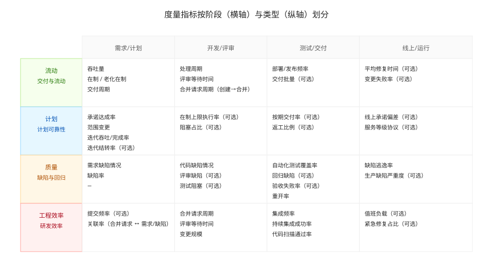

# 度量指标

[中文](../zh-CN/metrics.md) | [日本語](../ja-JP/metrics.md) | [English](../en-US/metrics.md)

## 本系统关注哪些度量

本系统围绕“交付效率 + 流动健康 + 质量风险 + 计划可靠性 + 工程效率”构建指标集，支持按数据可用性降级。

## 指标分类

### 交付与流动

- 吞吐量：时间窗内完成的工作项数量
- 交付周期：从创建到完成（p50/p75/p95）
- 处理周期：从开始处理到完成（p50/p75/p95）
- 平均在制（WIP）：时间窗内平均在制数量（按配置的 WIP 状态集合）
- 老化在制（Aging WIP）：在制超过阈值的条目（用于定位阻塞与排队点）

主要数据源：项目管理系统（`data_source`）

### 质量

- 需求缺陷情况：需求阶段发现的问题/缺陷（可按“澄清次数、返工、验收失败、需求变更”口径之一落地）
- 代码缺陷情况：开发阶段暴露的问题/缺陷（可按“代码扫描问题、评审缺陷、缺陷密度”等口径之一落地）
- 缺陷率：Bug 完成数 / 总完成数（同窗）
- 重开率：被重开比例（通常在测试/验收阶段暴露并回流）（项目管理或 bug 系统择优）
- 缺陷逃逸率：线上/生产缺陷数量或比例（按 `bug_source` 的识别规则）
- 自动化测试覆盖率：自动化用例覆盖率或覆盖的关键路径比例（按团队口径落地）

主要数据源：Bug 系统（`bug_source`）+ 项目管理系统（`data_source`）

### 计划可靠性

- 承诺达成率：承诺项按期完成比例（如有迭代承诺/范围数据）
- 范围变更：迭代内新增/移除项
- 迭代吞吐率：每个迭代完成的工作项数量（或 points，按团队口径）
- 迭代完成率：迭代内“完成数 / 承诺数”（或 完成 points / 承诺 points）
- 迭代结转率（可选）：迭代未完成并结转到下个迭代的比例

主要数据源：项目管理系统（`data_source`）

### 工程效率

- PR 周期：PR 创建到合并（p50/p75/p95）
- 评审等待：PR 创建到首个 review（p50/p75/p95）
- 变更规模：PR 变更大小分布（files/lines，若可得）
- PR ↔ 需求关联率：能否从 PR 标题/分支/commit message 提取并映射到工作项（若可得）

主要数据源：Git（`git_source`）

### 持续集成

- 持续集成频率：构建/集成流水线运行频率
- CI 成功率：流水线成功率
- 代码扫描通过率：代码扫描通过率

主要数据源：CI（`ci_source`）

## 口径与阈值

阈值来自 `work/<project_id>/meta/config.yaml` 的 `metrics.targets`，用于红黄绿判定与问题抽取。对于不同团队/业务形态，建议只对少数关键指标设硬阈值，其余以趋势与异常样本为主。

## 前端如何配置“展示哪些指标”

前端页面支持按项目配置“展示哪些指标”（只影响展示，不改变计算产物）：

1. 打开前端：`http://127.0.0.1:5173/frontend/`
2. 在页面中选择 `project_id`
3. 打开“度量指标配置（metrics.json）”页勾选要展示的指标（参考上方的指标地图）
4. 保存并导出 `metrics.json`，放到：
   - `work/<project_id>/meta/metrics.json`
